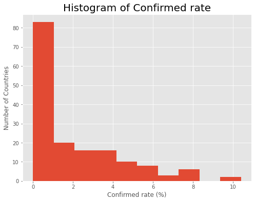

> Dataset can be found in kaggle
https://www.kaggle.com/mariaren/covid19-healthy-diet-dataset</p>
> Dataset copy can also found in drive：
https://drive.google.com/drive/u/0/folders/18cpebVnkuyhYq7a9ALHf-pxDClJxiaiW</p>
> My Github blog link:
https://ruishita.github.io/EDA_project_Ruishitao.html

I am going to do a data analysis using the dataset-`Covid-19 Health Diet Dataset`. My goal is to compare US with the country with lower confirmed in order to figure out the diet structure differences of the two countries I selected. I will try to get a conclusion on which country has a healthier diet structure which may be able to fight against the pandemic. Furthermore, I will explore the diet structure differences between countries with lower confirmed rates and higher confirmed rates, which involves most of the countries in the dataset.


```python
# Importing required libraries
import pandas as pd
import numpy as np
import seaborn as sns
import matplotlib as mpl
import matplotlib.pyplot as plt
from matplotlib.patches import ConnectionPatch
import warnings

warnings.filterwarnings('ignore')
```

# Dataset Introduction

This dataset consists of data of different types of food, world population obesity and undernourished rate, and global COVID-19 cases count from around the world in order to learn more about how a healthy eating style could help combat the Corona Virus. The data is stored in four csv files, including fat quantity, energy intake (kcal), food supply quantity (kg), and protein for different categories of food (all calculated as percentage of total intake amount). The obesity and undernourished rate (also in percentage) are also added in each file for comparison. The end of the datasets also included the most up to date confirmed/deaths/recovered/active cases (also in percentage of current population for each country). And from the dataset, I will gather information regarding diet patterns from countries with lower COVID infection rate, and adjust our own diet accordingly. 

Next I will start the exploration by first examining the shape and structure of the data. What dimensions/variables does it contain and how are the data values distributed? Are there any notable data quality issues? Find out if there are missing values in the data and think of how I can handle them. 

## Fat Supply Quantity Data

This dataset includes percentage of fat intake from different types of food in countries around the world. The last couple of columns also includes counts of obesity, undernourished, and COVID-19 cases as percentages of the total population for comparison purposes. 


```python
## read file
dfFat=pd.read_csv('Fat_Supply_Quantity_Data.csv')
```


```python
dfFat.shape
```


    (170, 32)


```python
# find out the data structure of Fat_Supply_Quantity_Data
dfFat.head()
```


<div>
<style scoped>
    .dataframe tbody tr th:only-of-type {
        vertical-align: middle;
    }

    .dataframe tbody tr th {
        vertical-align: top;
    }

    .dataframe thead th {
        text-align: right;
    }
</style>
<table border="1" class="dataframe">
  <thead>
    <tr style="text-align: right;">
      <th></th>
      <th>Country</th>
      <th>Alcoholic Beverages</th>
      <th>Animal Products</th>
      <th>Animal fats</th>
      <th>Aquatic Products, Other</th>
      <th>Cereals - Excluding Beer</th>
      <th>Eggs</th>
      <th>Fish, Seafood</th>
      <th>Fruits - Excluding Wine</th>
      <th>Meat</th>
      <th>...</th>
      <th>Vegetable Oils</th>
      <th>Vegetables</th>
      <th>Obesity</th>
      <th>Undernourished</th>
      <th>Confirmed</th>
      <th>Deaths</th>
      <th>Recovered</th>
      <th>Active</th>
      <th>Population</th>
      <th>Unit (all except Population)</th>
    </tr>
  </thead>
  <tbody>
    <tr>
      <th>0</th>
      <td>Afghanistan</td>
      <td>0.0</td>
      <td>21.6397</td>
      <td>6.2224</td>
      <td>0.0</td>
      <td>8.0353</td>
      <td>0.6859</td>
      <td>0.0327</td>
      <td>0.4246</td>
      <td>6.1244</td>
      <td>...</td>
      <td>17.0831</td>
      <td>0.3593</td>
      <td>4.5</td>
      <td>29.8</td>
      <td>0.142134</td>
      <td>0.006186</td>
      <td>0.123374</td>
      <td>0.012574</td>
      <td>38928000.0</td>
      <td>%</td>
    </tr>
    <tr>
      <th>1</th>
      <td>Albania</td>
      <td>0.0</td>
      <td>32.0002</td>
      <td>3.4172</td>
      <td>0.0</td>
      <td>2.6734</td>
      <td>1.6448</td>
      <td>0.1445</td>
      <td>0.6418</td>
      <td>8.7428</td>
      <td>...</td>
      <td>9.2443</td>
      <td>0.6503</td>
      <td>22.3</td>
      <td>6.2</td>
      <td>2.967301</td>
      <td>0.050951</td>
      <td>1.792636</td>
      <td>1.123714</td>
      <td>2838000.0</td>
      <td>%</td>
    </tr>
    <tr>
      <th>2</th>
      <td>Algeria</td>
      <td>0.0</td>
      <td>14.4175</td>
      <td>0.8972</td>
      <td>0.0</td>
      <td>4.2035</td>
      <td>1.2171</td>
      <td>0.2008</td>
      <td>0.5772</td>
      <td>3.8961</td>
      <td>...</td>
      <td>27.3606</td>
      <td>0.5145</td>
      <td>26.6</td>
      <td>3.9</td>
      <td>0.244897</td>
      <td>0.006558</td>
      <td>0.167572</td>
      <td>0.070767</td>
      <td>44357000.0</td>
      <td>%</td>
    </tr>
    <tr>
      <th>3</th>
      <td>Angola</td>
      <td>0.0</td>
      <td>15.3041</td>
      <td>1.3130</td>
      <td>0.0</td>
      <td>6.5545</td>
      <td>0.1539</td>
      <td>1.4155</td>
      <td>0.3488</td>
      <td>11.0268</td>
      <td>...</td>
      <td>22.4638</td>
      <td>0.1231</td>
      <td>6.8</td>
      <td>25</td>
      <td>0.061687</td>
      <td>0.001461</td>
      <td>0.056808</td>
      <td>0.003419</td>
      <td>32522000.0</td>
      <td>%</td>
    </tr>
    <tr>
      <th>4</th>
      <td>Antigua and Barbuda</td>
      <td>0.0</td>
      <td>27.7033</td>
      <td>4.6686</td>
      <td>0.0</td>
      <td>3.2153</td>
      <td>0.3872</td>
      <td>1.5263</td>
      <td>1.2177</td>
      <td>14.3202</td>
      <td>...</td>
      <td>14.4436</td>
      <td>0.2469</td>
      <td>19.1</td>
      <td>NaN</td>
      <td>0.293878</td>
      <td>0.007143</td>
      <td>0.190816</td>
      <td>0.095918</td>
      <td>98000.0</td>
      <td>%</td>
    </tr>
  </tbody>
</table>
<p>5 rows × 32 columns</p>
</div>


```python
dfFat.info()
```

    <class 'pandas.core.frame.DataFrame'>
    RangeIndex: 170 entries, 0 to 169
    Data columns (total 32 columns):
     #   Column                        Non-Null Count  Dtype  
    ---  ------                        --------------  -----  
     0   Country                       170 non-null    object 
     1   Alcoholic Beverages           170 non-null    float64
     2   Animal Products               170 non-null    float64
     3   Animal fats                   170 non-null    float64
     4   Aquatic Products, Other       170 non-null    float64
     5   Cereals - Excluding Beer      170 non-null    float64
     6   Eggs                          170 non-null    float64
     7   Fish, Seafood                 170 non-null    float64
     8   Fruits - Excluding Wine       170 non-null    float64
     9   Meat                          170 non-null    float64
     10  Miscellaneous                 170 non-null    float64
     11  Milk - Excluding Butter       170 non-null    float64
     12  Offals                        170 non-null    float64
     13  Oilcrops                      170 non-null    float64
     14  Pulses                        170 non-null    float64
     15  Spices                        170 non-null    float64
     16  Starchy Roots                 170 non-null    float64
     17  Stimulants                    170 non-null    float64
     18  Sugar Crops                   170 non-null    float64
     19  Sugar & Sweeteners            170 non-null    float64
     20  Treenuts                      170 non-null    float64
     21  Vegetal Products              170 non-null    float64
     22  Vegetable Oils                170 non-null    float64
     23  Vegetables                    170 non-null    float64
     24  Obesity                       167 non-null    float64
     25  Undernourished                163 non-null    object 
     26  Confirmed                     164 non-null    float64
     27  Deaths                        164 non-null    float64
     28  Recovered                     164 non-null    float64
     29  Active                        162 non-null    float64
     30  Population                    170 non-null    float64
     31  Unit (all except Population)  170 non-null    object 
    dtypes: float64(29), object(3)
    memory usage: 42.6+ KB
    

## Food Supply Quantity(kg) Data

This dataset includes percentage of food intake (kg) in countries around the world. The last couple of columns also includes counts of obesity, undernourished, and COVID-19 cases as percentages of the total population for comparison purposes.


```python
#data structure for Food_Supply_Quantity_kg_Data
dfFoodQ=pd.read_csv('Food_Supply_Quantity_kg_Data.csv')
dfFoodQ.head()
```


<div>
<style scoped>
    .dataframe tbody tr th:only-of-type {
        vertical-align: middle;
    }

    .dataframe tbody tr th {
        vertical-align: top;
    }

    .dataframe thead th {
        text-align: right;
    }
</style>
<table border="1" class="dataframe">
  <thead>
    <tr style="text-align: right;">
      <th></th>
      <th>Country</th>
      <th>Alcoholic Beverages</th>
      <th>Animal fats</th>
      <th>Animal Products</th>
      <th>Aquatic Products, Other</th>
      <th>Cereals - Excluding Beer</th>
      <th>Eggs</th>
      <th>Fish, Seafood</th>
      <th>Fruits - Excluding Wine</th>
      <th>Meat</th>
      <th>...</th>
      <th>Vegetables</th>
      <th>Vegetal Products</th>
      <th>Obesity</th>
      <th>Undernourished</th>
      <th>Confirmed</th>
      <th>Deaths</th>
      <th>Recovered</th>
      <th>Active</th>
      <th>Population</th>
      <th>Unit (all except Population)</th>
    </tr>
  </thead>
  <tbody>
    <tr>
      <th>0</th>
      <td>Afghanistan</td>
      <td>0.0014</td>
      <td>0.1973</td>
      <td>9.4341</td>
      <td>0.0</td>
      <td>24.8097</td>
      <td>0.2099</td>
      <td>0.0350</td>
      <td>5.3495</td>
      <td>1.2020</td>
      <td>...</td>
      <td>6.7642</td>
      <td>40.5645</td>
      <td>4.5</td>
      <td>29.8</td>
      <td>0.142134</td>
      <td>0.006186</td>
      <td>0.123374</td>
      <td>0.012574</td>
      <td>38928000.0</td>
      <td>%</td>
    </tr>
    <tr>
      <th>1</th>
      <td>Albania</td>
      <td>1.6719</td>
      <td>0.1357</td>
      <td>18.7684</td>
      <td>0.0</td>
      <td>5.7817</td>
      <td>0.5815</td>
      <td>0.2126</td>
      <td>6.7861</td>
      <td>1.8845</td>
      <td>...</td>
      <td>11.7753</td>
      <td>31.2304</td>
      <td>22.3</td>
      <td>6.2</td>
      <td>2.967301</td>
      <td>0.050951</td>
      <td>1.792636</td>
      <td>1.123714</td>
      <td>2838000.0</td>
      <td>%</td>
    </tr>
    <tr>
      <th>2</th>
      <td>Algeria</td>
      <td>0.2711</td>
      <td>0.0282</td>
      <td>9.6334</td>
      <td>0.0</td>
      <td>13.6816</td>
      <td>0.5277</td>
      <td>0.2416</td>
      <td>6.3801</td>
      <td>1.1305</td>
      <td>...</td>
      <td>11.6484</td>
      <td>40.3651</td>
      <td>26.6</td>
      <td>3.9</td>
      <td>0.244897</td>
      <td>0.006558</td>
      <td>0.167572</td>
      <td>0.070767</td>
      <td>44357000.0</td>
      <td>%</td>
    </tr>
    <tr>
      <th>3</th>
      <td>Angola</td>
      <td>5.8087</td>
      <td>0.0560</td>
      <td>4.9278</td>
      <td>0.0</td>
      <td>9.1085</td>
      <td>0.0587</td>
      <td>1.7707</td>
      <td>6.0005</td>
      <td>2.0571</td>
      <td>...</td>
      <td>2.3041</td>
      <td>45.0722</td>
      <td>6.8</td>
      <td>25</td>
      <td>0.061687</td>
      <td>0.001461</td>
      <td>0.056808</td>
      <td>0.003419</td>
      <td>32522000.0</td>
      <td>%</td>
    </tr>
    <tr>
      <th>4</th>
      <td>Antigua and Barbuda</td>
      <td>3.5764</td>
      <td>0.0087</td>
      <td>16.6613</td>
      <td>0.0</td>
      <td>5.9960</td>
      <td>0.2274</td>
      <td>4.1489</td>
      <td>10.7451</td>
      <td>5.6888</td>
      <td>...</td>
      <td>5.4495</td>
      <td>33.3233</td>
      <td>19.1</td>
      <td>NaN</td>
      <td>0.293878</td>
      <td>0.007143</td>
      <td>0.190816</td>
      <td>0.095918</td>
      <td>98000.0</td>
      <td>%</td>
    </tr>
  </tbody>
</table>
<p>5 rows × 32 columns</p>
</div>


```python
dfFoodQ.shape
```


    (170, 32)


```python
dfFoodQ.info()
```

    <class 'pandas.core.frame.DataFrame'>
    RangeIndex: 170 entries, 0 to 169
    Data columns (total 32 columns):
     #   Column                        Non-Null Count  Dtype  
    ---  ------                        --------------  -----  
     0   Country                       170 non-null    object 
     1   Alcoholic Beverages           170 non-null    float64
     2   Animal fats                   170 non-null    float64
     3   Animal Products               170 non-null    float64
     4   Aquatic Products, Other       170 non-null    float64
     5   Cereals - Excluding Beer      170 non-null    float64
     6   Eggs                          170 non-null    float64
     7   Fish, Seafood                 170 non-null    float64
     8   Fruits - Excluding Wine       170 non-null    float64
     9   Meat                          170 non-null    float64
     10  Milk - Excluding Butter       170 non-null    float64
     11  Miscellaneous                 170 non-null    float64
     12  Offals                        170 non-null    float64
     13  Oilcrops                      170 non-null    float64
     14  Pulses                        170 non-null    float64
     15  Spices                        170 non-null    float64
     16  Starchy Roots                 170 non-null    float64
     17  Stimulants                    170 non-null    float64
     18  Sugar & Sweeteners            170 non-null    float64
     19  Sugar Crops                   170 non-null    float64
     20  Treenuts                      170 non-null    float64
     21  Vegetable Oils                170 non-null    float64
     22  Vegetables                    170 non-null    float64
     23  Vegetal Products              170 non-null    float64
     24  Obesity                       167 non-null    float64
     25  Undernourished                163 non-null    object 
     26  Confirmed                     164 non-null    float64
     27  Deaths                        164 non-null    float64
     28  Recovered                     164 non-null    float64
     29  Active                        162 non-null    float64
     30  Population                    170 non-null    float64
     31  Unit (all except Population)  170 non-null    object 
    dtypes: float64(29), object(3)
    memory usage: 42.6+ KB
    

## Food Supply Kcal Data

This dataset includes percentage of energy intake (kcal) from different types of food in countries around the world. The last couple of columns also includes counts of obesity, undernourished, and COVID-19 cases as percentages of the total population for comparison purposes.


```python
#data structure for Food_Supply_kcal_Data.csv
dfFoodK=pd.read_csv('Food_Supply_kcal_Data.csv')
dfFoodK.head()
```


<div>
<style scoped>
    .dataframe tbody tr th:only-of-type {
        vertical-align: middle;
    }

    .dataframe tbody tr th {
        vertical-align: top;
    }

    .dataframe thead th {
        text-align: right;
    }
</style>
<table border="1" class="dataframe">
  <thead>
    <tr style="text-align: right;">
      <th></th>
      <th>Country</th>
      <th>Alcoholic Beverages</th>
      <th>Animal Products</th>
      <th>Animal fats</th>
      <th>Aquatic Products, Other</th>
      <th>Cereals - Excluding Beer</th>
      <th>Eggs</th>
      <th>Fish, Seafood</th>
      <th>Fruits - Excluding Wine</th>
      <th>Meat</th>
      <th>...</th>
      <th>Vegetable Oils</th>
      <th>Vegetables</th>
      <th>Obesity</th>
      <th>Undernourished</th>
      <th>Confirmed</th>
      <th>Deaths</th>
      <th>Recovered</th>
      <th>Active</th>
      <th>Population</th>
      <th>Unit (all except Population)</th>
    </tr>
  </thead>
  <tbody>
    <tr>
      <th>0</th>
      <td>Afghanistan</td>
      <td>0.0000</td>
      <td>4.7774</td>
      <td>0.8504</td>
      <td>0.0</td>
      <td>37.1186</td>
      <td>0.1501</td>
      <td>0.0000</td>
      <td>1.4757</td>
      <td>1.2006</td>
      <td>...</td>
      <td>2.3012</td>
      <td>0.7504</td>
      <td>4.5</td>
      <td>29.8</td>
      <td>0.142134</td>
      <td>0.006186</td>
      <td>0.123374</td>
      <td>0.012574</td>
      <td>38928000.0</td>
      <td>%</td>
    </tr>
    <tr>
      <th>1</th>
      <td>Albania</td>
      <td>0.9120</td>
      <td>16.0930</td>
      <td>1.0591</td>
      <td>0.0</td>
      <td>16.2107</td>
      <td>0.8091</td>
      <td>0.1471</td>
      <td>3.8982</td>
      <td>3.8688</td>
      <td>...</td>
      <td>2.8244</td>
      <td>2.7508</td>
      <td>22.3</td>
      <td>6.2</td>
      <td>2.967301</td>
      <td>0.050951</td>
      <td>1.792636</td>
      <td>1.123714</td>
      <td>2838000.0</td>
      <td>%</td>
    </tr>
    <tr>
      <th>2</th>
      <td>Algeria</td>
      <td>0.0896</td>
      <td>6.0326</td>
      <td>0.1941</td>
      <td>0.0</td>
      <td>25.0112</td>
      <td>0.4181</td>
      <td>0.1195</td>
      <td>3.1805</td>
      <td>1.2543</td>
      <td>...</td>
      <td>5.7638</td>
      <td>2.0457</td>
      <td>26.6</td>
      <td>3.9</td>
      <td>0.244897</td>
      <td>0.006558</td>
      <td>0.167572</td>
      <td>0.070767</td>
      <td>44357000.0</td>
      <td>%</td>
    </tr>
    <tr>
      <th>3</th>
      <td>Angola</td>
      <td>1.9388</td>
      <td>4.6927</td>
      <td>0.2644</td>
      <td>0.0</td>
      <td>18.3521</td>
      <td>0.0441</td>
      <td>0.8372</td>
      <td>2.3133</td>
      <td>2.9302</td>
      <td>...</td>
      <td>4.2741</td>
      <td>0.3525</td>
      <td>6.8</td>
      <td>25</td>
      <td>0.061687</td>
      <td>0.001461</td>
      <td>0.056808</td>
      <td>0.003419</td>
      <td>32522000.0</td>
      <td>%</td>
    </tr>
    <tr>
      <th>4</th>
      <td>Antigua and Barbuda</td>
      <td>2.3041</td>
      <td>15.3672</td>
      <td>1.5429</td>
      <td>0.0</td>
      <td>13.7215</td>
      <td>0.2057</td>
      <td>1.7280</td>
      <td>3.6824</td>
      <td>7.0356</td>
      <td>...</td>
      <td>4.6904</td>
      <td>1.2960</td>
      <td>19.1</td>
      <td>NaN</td>
      <td>0.293878</td>
      <td>0.007143</td>
      <td>0.190816</td>
      <td>0.095918</td>
      <td>98000.0</td>
      <td>%</td>
    </tr>
  </tbody>
</table>
<p>5 rows × 32 columns</p>
</div>


```python
dfFoodK.shape
```


    (170, 32)


```python
dfFoodK.info()
```

    <class 'pandas.core.frame.DataFrame'>
    RangeIndex: 170 entries, 0 to 169
    Data columns (total 32 columns):
     #   Column                        Non-Null Count  Dtype  
    ---  ------                        --------------  -----  
     0   Country                       170 non-null    object 
     1   Alcoholic Beverages           170 non-null    float64
     2   Animal Products               170 non-null    float64
     3   Animal fats                   170 non-null    float64
     4   Aquatic Products, Other       170 non-null    float64
     5   Cereals - Excluding Beer      170 non-null    float64
     6   Eggs                          170 non-null    float64
     7   Fish, Seafood                 170 non-null    float64
     8   Fruits - Excluding Wine       170 non-null    float64
     9   Meat                          170 non-null    float64
     10  Milk - Excluding Butter       170 non-null    float64
     11  Miscellaneous                 170 non-null    float64
     12  Offals                        170 non-null    float64
     13  Oilcrops                      170 non-null    float64
     14  Pulses                        170 non-null    float64
     15  Spices                        170 non-null    float64
     16  Starchy Roots                 170 non-null    float64
     17  Stimulants                    170 non-null    float64
     18  Sugar Crops                   170 non-null    float64
     19  Sugar & Sweeteners            170 non-null    float64
     20  Treenuts                      170 non-null    float64
     21  Vegetal Products              170 non-null    float64
     22  Vegetable Oils                170 non-null    float64
     23  Vegetables                    170 non-null    float64
     24  Obesity                       167 non-null    float64
     25  Undernourished                163 non-null    object 
     26  Confirmed                     164 non-null    float64
     27  Deaths                        164 non-null    float64
     28  Recovered                     164 non-null    float64
     29  Active                        162 non-null    float64
     30  Population                    170 non-null    float64
     31  Unit (all except Population)  170 non-null    object 
    dtypes: float64(29), object(3)
    memory usage: 42.6+ KB
    

## Protein Supply Quantity Data

This dataset includes percentage of protein intake from different types of food in countries around the world. The last couple of columns also includes counts of obesity, undernourished, and COVID-19 cases as percentages of the total population for comparison purposes.


```python
dfProteinQ=pd.read_csv('Protein_Supply_Quantity_Data.csv')
dfProteinQ.head()
```


<div>
<style scoped>
    .dataframe tbody tr th:only-of-type {
        vertical-align: middle;
    }

    .dataframe tbody tr th {
        vertical-align: top;
    }

    .dataframe thead th {
        text-align: right;
    }
</style>
<table border="1" class="dataframe">
  <thead>
    <tr style="text-align: right;">
      <th></th>
      <th>Country</th>
      <th>Alcoholic Beverages</th>
      <th>Animal Products</th>
      <th>Animal fats</th>
      <th>Aquatic Products, Other</th>
      <th>Cereals - Excluding Beer</th>
      <th>Eggs</th>
      <th>Fish, Seafood</th>
      <th>Fruits - Excluding Wine</th>
      <th>Meat</th>
      <th>...</th>
      <th>Vegetables</th>
      <th>Miscellaneous</th>
      <th>Obesity</th>
      <th>Undernourished</th>
      <th>Confirmed</th>
      <th>Deaths</th>
      <th>Recovered</th>
      <th>Active</th>
      <th>Population</th>
      <th>Unit (all except Population)</th>
    </tr>
  </thead>
  <tbody>
    <tr>
      <th>0</th>
      <td>Afghanistan</td>
      <td>0.0000</td>
      <td>9.7523</td>
      <td>0.0277</td>
      <td>0.0</td>
      <td>35.9771</td>
      <td>0.4067</td>
      <td>0.0647</td>
      <td>0.5824</td>
      <td>3.1337</td>
      <td>...</td>
      <td>1.1370</td>
      <td>0.0462</td>
      <td>4.5</td>
      <td>29.8</td>
      <td>0.142134</td>
      <td>0.006186</td>
      <td>0.123374</td>
      <td>0.012574</td>
      <td>38928000.0</td>
      <td>%</td>
    </tr>
    <tr>
      <th>1</th>
      <td>Albania</td>
      <td>0.1840</td>
      <td>27.7469</td>
      <td>0.0711</td>
      <td>0.0</td>
      <td>14.2331</td>
      <td>1.8069</td>
      <td>0.6274</td>
      <td>1.2757</td>
      <td>7.6582</td>
      <td>...</td>
      <td>3.2456</td>
      <td>0.0544</td>
      <td>22.3</td>
      <td>6.2</td>
      <td>2.967301</td>
      <td>0.050951</td>
      <td>1.792636</td>
      <td>1.123714</td>
      <td>2838000.0</td>
      <td>%</td>
    </tr>
    <tr>
      <th>2</th>
      <td>Algeria</td>
      <td>0.0323</td>
      <td>13.8360</td>
      <td>0.0054</td>
      <td>0.0</td>
      <td>26.5633</td>
      <td>1.2916</td>
      <td>0.6350</td>
      <td>1.1624</td>
      <td>3.5088</td>
      <td>...</td>
      <td>3.1267</td>
      <td>0.1399</td>
      <td>26.6</td>
      <td>3.9</td>
      <td>0.244897</td>
      <td>0.006558</td>
      <td>0.167572</td>
      <td>0.070767</td>
      <td>44357000.0</td>
      <td>%</td>
    </tr>
    <tr>
      <th>3</th>
      <td>Angola</td>
      <td>0.6285</td>
      <td>15.2311</td>
      <td>0.0277</td>
      <td>0.0</td>
      <td>20.3882</td>
      <td>0.1756</td>
      <td>5.4436</td>
      <td>1.2754</td>
      <td>7.6248</td>
      <td>...</td>
      <td>0.8133</td>
      <td>0.0924</td>
      <td>6.8</td>
      <td>25</td>
      <td>0.061687</td>
      <td>0.001461</td>
      <td>0.056808</td>
      <td>0.003419</td>
      <td>32522000.0</td>
      <td>%</td>
    </tr>
    <tr>
      <th>4</th>
      <td>Antigua and Barbuda</td>
      <td>0.1535</td>
      <td>33.1901</td>
      <td>0.1289</td>
      <td>0.0</td>
      <td>10.5108</td>
      <td>0.4850</td>
      <td>8.2146</td>
      <td>1.2586</td>
      <td>16.0670</td>
      <td>...</td>
      <td>1.6024</td>
      <td>0.2947</td>
      <td>19.1</td>
      <td>NaN</td>
      <td>0.293878</td>
      <td>0.007143</td>
      <td>0.190816</td>
      <td>0.095918</td>
      <td>98000.0</td>
      <td>%</td>
    </tr>
  </tbody>
</table>
<p>5 rows × 32 columns</p>
</div>


```python
dfProteinQ.shape
```


    (170, 32)


```python
dfProteinQ.info()
```

    <class 'pandas.core.frame.DataFrame'>
    RangeIndex: 170 entries, 0 to 169
    Data columns (total 32 columns):
     #   Column                        Non-Null Count  Dtype  
    ---  ------                        --------------  -----  
     0   Country                       170 non-null    object 
     1   Alcoholic Beverages           170 non-null    float64
     2   Animal Products               170 non-null    float64
     3   Animal fats                   170 non-null    float64
     4   Aquatic Products, Other       170 non-null    float64
     5   Cereals - Excluding Beer      170 non-null    float64
     6   Eggs                          170 non-null    float64
     7   Fish, Seafood                 170 non-null    float64
     8   Fruits - Excluding Wine       170 non-null    float64
     9   Meat                          170 non-null    float64
     10  Milk - Excluding Butter       170 non-null    float64
     11  Offals                        170 non-null    float64
     12  Oilcrops                      170 non-null    float64
     13  Pulses                        170 non-null    float64
     14  Spices                        170 non-null    float64
     15  Starchy Roots                 170 non-null    float64
     16  Stimulants                    170 non-null    float64
     17  Sugar Crops                   170 non-null    float64
     18  Sugar & Sweeteners            170 non-null    float64
     19  Treenuts                      170 non-null    float64
     20  Vegetal Products              170 non-null    float64
     21  Vegetable Oils                170 non-null    float64
     22  Vegetables                    170 non-null    float64
     23  Miscellaneous                 170 non-null    float64
     24  Obesity                       167 non-null    float64
     25  Undernourished                163 non-null    object 
     26  Confirmed                     164 non-null    float64
     27  Deaths                        164 non-null    float64
     28  Recovered                     164 non-null    float64
     29  Active                        162 non-null    float64
     30  Population                    170 non-null    float64
     31  Unit (all except Population)  170 non-null    object 
    dtypes: float64(29), object(3)
    memory usage: 42.6+ KB
    

## Dealing with missing data

Above all, I observed that there are no missing values from column 0 to 23 in the dataset, and there are some missing data from variables obesity to active. By using pandas to check the missing values of the above datasets(as shown below), I noticed that the missing data in the above four data sets are the same. Since I do not need consider the data of these countries, I think that there is no noteworthy data-missing issues.


```python
dfFat[dfFat.isnull().any(axis=1)]['Country']
```


    4        Antigua and Barbuda
    10                   Bahamas
    26                    Canada
    29                     Chile
    52          French Polynesia
    59                   Grenada
    80                  Kiribati
    81              Korea, North
    105                  Myanmar
    109            New Caledonia
    124      Republic of Moldova
    128    Saint Kitts and Nevis
    129              Saint Lucia
    147                  Taiwan*
    148               Tajikistan
    155             Turkmenistan
    Name: Country, dtype: object


```python
dfFoodQ[dfFoodQ.isnull().any(axis=1)]['Country']
```


    4        Antigua and Barbuda
    10                   Bahamas
    26                    Canada
    29                     Chile
    52          French Polynesia
    59                   Grenada
    80                  Kiribati
    81              Korea, North
    105                  Myanmar
    109            New Caledonia
    124      Republic of Moldova
    128    Saint Kitts and Nevis
    129              Saint Lucia
    147                  Taiwan*
    148               Tajikistan
    155             Turkmenistan
    Name: Country, dtype: object


```python
dfFoodK[dfFoodK.isnull().any(axis=1)]['Country']
```


    4        Antigua and Barbuda
    10                   Bahamas
    26                    Canada
    29                     Chile
    52          French Polynesia
    59                   Grenada
    80                  Kiribati
    81              Korea, North
    105                  Myanmar
    109            New Caledonia
    124      Republic of Moldova
    128    Saint Kitts and Nevis
    129              Saint Lucia
    147                  Taiwan*
    148               Tajikistan
    155             Turkmenistan
    Name: Country, dtype: object


```python
dfProteinQ[dfProteinQ.isnull().any(axis=1)]['Country']
```


    4        Antigua and Barbuda
    10                   Bahamas
    26                    Canada
    29                     Chile
    52          French Polynesia
    59                   Grenada
    80                  Kiribati
    81              Korea, North
    105                  Myanmar
    109            New Caledonia
    124      Republic of Moldova
    128    Saint Kitts and Nevis
    129              Saint Lucia
    147                  Taiwan*
    148               Tajikistan
    155             Turkmenistan
    Name: Country, dtype: object


```python
print(dfFat[dfFat.isnull().any(axis=1)]['Country'] == dfFoodQ[dfFoodQ.isnull().any(axis=1)]['Country'])
print(dfFat[dfFat.isnull().any(axis=1)]['Country'] == dfFoodK[dfFoodK.isnull().any(axis=1)]['Country'])
print(dfFat[dfFat.isnull().any(axis=1)]['Country'] == dfProteinQ[dfProteinQ.isnull().any(axis=1)]['Country'])
```

    4      True
    10     True
    26     True
    29     True
    52     True
    59     True
    80     True
    81     True
    105    True
    109    True
    124    True
    128    True
    129    True
    147    True
    148    True
    155    True
    Name: Country, dtype: bool
    4      True
    10     True
    26     True
    29     True
    52     True
    59     True
    80     True
    81     True
    105    True
    109    True
    124    True
    128    True
    129    True
    147    True
    148    True
    155    True
    Name: Country, dtype: bool
    4      True
    10     True
    26     True
    29     True
    52     True
    59     True
    80     True
    81     True
    105    True
    109    True
    124    True
    128    True
    129    True
    147    True
    148    True
    155    True
    Name: Country, dtype: bool
    

## Supply Food Data Descriptions

This dataset is used to show the specific types of food that belongs to each category for the above datasets. 


```python
dfDes=pd.read_csv('Supply_Food_Data_Descriptions.csv')
dfDes
```


<div>
<style scoped>
    .dataframe tbody tr th:only-of-type {
        vertical-align: middle;
    }

    .dataframe tbody tr th {
        vertical-align: top;
    }

    .dataframe thead th {
        text-align: right;
    }
</style>
<table border="1" class="dataframe">
  <thead>
    <tr style="text-align: right;">
      <th></th>
      <th>Categories</th>
      <th>Items</th>
    </tr>
  </thead>
  <tbody>
    <tr>
      <th>0</th>
      <td>Alcoholic Beverages</td>
      <td>Alcohol, Non-Food; Beer; Beverages, Alcoholic;...</td>
    </tr>
    <tr>
      <th>1</th>
      <td>Animal fats</td>
      <td>Butter, Ghee; Cream; Fats, Animals, Raw; Fish,...</td>
    </tr>
    <tr>
      <th>2</th>
      <td>Animal Products</td>
      <td>Aquatic Animals, Others; Aquatic Plants; Bovin...</td>
    </tr>
    <tr>
      <th>3</th>
      <td>Aquatic Products, Other</td>
      <td>Aquatic Animals, Others; Aquatic Plants; Meat,...</td>
    </tr>
    <tr>
      <th>4</th>
      <td>Cereals - Excluding Beer</td>
      <td>Barley and products; Cereals, Other; Maize and...</td>
    </tr>
    <tr>
      <th>5</th>
      <td>Eggs</td>
      <td>Eggs</td>
    </tr>
    <tr>
      <th>6</th>
      <td>Fish, Seafood</td>
      <td>Cephalopods; Crustaceans; Demersal Fish; Fresh...</td>
    </tr>
    <tr>
      <th>7</th>
      <td>Fruits - Excluding Wine</td>
      <td>Apples and products; Bananas; Citrus, Other; D...</td>
    </tr>
    <tr>
      <th>8</th>
      <td>Meat</td>
      <td>Bovine Meat; Meat, Other; Mutton &amp; Goat Meat; ...</td>
    </tr>
    <tr>
      <th>9</th>
      <td>Milk - Excluding Butter</td>
      <td>Milk - Excluding Butter</td>
    </tr>
    <tr>
      <th>10</th>
      <td>Miscellaneous</td>
      <td>Infant food; Miscellaneous</td>
    </tr>
    <tr>
      <th>11</th>
      <td>Offals</td>
      <td>Offals, Edible</td>
    </tr>
    <tr>
      <th>12</th>
      <td>Oilcrops</td>
      <td>Coconuts - Incl Copra; Cottonseed; Groundnuts ...</td>
    </tr>
    <tr>
      <th>13</th>
      <td>Pulses</td>
      <td>Beans; Peas; Pulses, Other and products</td>
    </tr>
    <tr>
      <th>14</th>
      <td>Spices</td>
      <td>Cloves; Pepper; Pimento; Spices, Other</td>
    </tr>
    <tr>
      <th>15</th>
      <td>Starchy Roots</td>
      <td>Cassava and products; Potatoes and products; R...</td>
    </tr>
    <tr>
      <th>16</th>
      <td>Stimulants</td>
      <td>Cocoa Beans and products; Coffee and products;...</td>
    </tr>
    <tr>
      <th>17</th>
      <td>Sugar &amp; Sweeteners</td>
      <td>Honey; Sugar (Raw Equivalent); Sugar non-centr...</td>
    </tr>
    <tr>
      <th>18</th>
      <td>Sugar Crops</td>
      <td>Sugar beet; Sugar cane</td>
    </tr>
    <tr>
      <th>19</th>
      <td>Treenuts</td>
      <td>Nuts and products</td>
    </tr>
    <tr>
      <th>20</th>
      <td>Vegetable Oils</td>
      <td>Coconut Oil; Cottonseed Oil; Groundnut Oil; Ma...</td>
    </tr>
    <tr>
      <th>21</th>
      <td>Vegetables</td>
      <td>Onions; Tomatoes and products; Vegetables, Other</td>
    </tr>
    <tr>
      <th>22</th>
      <td>Vegetal Products</td>
      <td>Alcohol, Non-Food; Apples and products; Banana...</td>
    </tr>
  </tbody>
</table>
</div>


```python
dfDes.shape
```


    (23, 2)


```python
dfDes.info()
```

    <class 'pandas.core.frame.DataFrame'>
    RangeIndex: 23 entries, 0 to 22
    Data columns (total 2 columns):
     #   Column      Non-Null Count  Dtype 
    ---  ------      --------------  ----- 
     0   Categories  23 non-null     object
     1   Items       23 non-null     object
    dtypes: object(2)
    memory usage: 496.0+ bytes
    

# Distribution of  COVID-19 cases

I first plot four simple histograms to show the distribution of different COVID-19 cases for visual inspection. Because these data is all the same in the above four datasets, I extract the data from the `Fat Supply Quantity Data`. 


```python
covid_19_cases = dfFat[['Country', 'Confirmed', 'Deaths', 'Recovered', 'Active']]
covid_19_cases
```


<div>
<style scoped>
    .dataframe tbody tr th:only-of-type {
        vertical-align: middle;
    }

    .dataframe tbody tr th {
        vertical-align: top;
    }

    .dataframe thead th {
        text-align: right;
    }
</style>
<table border="1" class="dataframe">
  <thead>
    <tr style="text-align: right;">
      <th></th>
      <th>Country</th>
      <th>Confirmed</th>
      <th>Deaths</th>
      <th>Recovered</th>
      <th>Active</th>
    </tr>
  </thead>
  <tbody>
    <tr>
      <th>0</th>
      <td>Afghanistan</td>
      <td>0.142134</td>
      <td>0.006186</td>
      <td>0.123374</td>
      <td>0.012574</td>
    </tr>
    <tr>
      <th>1</th>
      <td>Albania</td>
      <td>2.967301</td>
      <td>0.050951</td>
      <td>1.792636</td>
      <td>1.123714</td>
    </tr>
    <tr>
      <th>2</th>
      <td>Algeria</td>
      <td>0.244897</td>
      <td>0.006558</td>
      <td>0.167572</td>
      <td>0.070767</td>
    </tr>
    <tr>
      <th>3</th>
      <td>Angola</td>
      <td>0.061687</td>
      <td>0.001461</td>
      <td>0.056808</td>
      <td>0.003419</td>
    </tr>
    <tr>
      <th>4</th>
      <td>Antigua and Barbuda</td>
      <td>0.293878</td>
      <td>0.007143</td>
      <td>0.190816</td>
      <td>0.095918</td>
    </tr>
    <tr>
      <th>...</th>
      <td>...</td>
      <td>...</td>
      <td>...</td>
      <td>...</td>
      <td>...</td>
    </tr>
    <tr>
      <th>165</th>
      <td>Venezuela (Bolivarian Republic of)</td>
      <td>0.452585</td>
      <td>0.004287</td>
      <td>0.424399</td>
      <td>0.023899</td>
    </tr>
    <tr>
      <th>166</th>
      <td>Vietnam</td>
      <td>0.002063</td>
      <td>0.000036</td>
      <td>0.001526</td>
      <td>0.000501</td>
    </tr>
    <tr>
      <th>167</th>
      <td>Yemen</td>
      <td>0.007131</td>
      <td>0.002062</td>
      <td>0.004788</td>
      <td>0.000282</td>
    </tr>
    <tr>
      <th>168</th>
      <td>Zambia</td>
      <td>0.334133</td>
      <td>0.004564</td>
      <td>0.290524</td>
      <td>0.039045</td>
    </tr>
    <tr>
      <th>169</th>
      <td>Zimbabwe</td>
      <td>0.232033</td>
      <td>0.008854</td>
      <td>0.190964</td>
      <td>0.032214</td>
    </tr>
  </tbody>
</table>
<p>170 rows × 5 columns</p>
</div>


```python
plt.figure(figsize=(8, 6))
plt.hist(covid_19_cases['Confirmed'])
plt.xlabel('Confirmed rate (%)')
plt.ylabel('Number of Countries')
plt.title('Histogram of Confirmed rate', fontsize=20)
plt.show()
```


    

    


```python
plt.figure(figsize=(8, 6))
plt.hist(covid_19_cases['Deaths'])
plt.xlabel('Death rate (%)')
plt.ylabel('Number of Countries')
plt.title('Histogram of death rate', fontsize=20)
plt.show()
```


    

    


```python
plt.figure(figsize=(8, 6))
plt.hist(covid_19_cases['Recovered'])
plt.xlabel('Recovered Rate (%)')
plt.ylabel('Number of Countries')
plt.title('Histogram of Recovered Rate', fontsize=20)
```


    Text(0.5, 1.0, 'Histogram of Recovered Rate')


    

    


```python
plt.figure(figsize=(8, 6))
plt.hist(covid_19_cases['Active'])
plt.xlabel('Active Rate (%)')
plt.ylabel('Number of Countries')
plt.title('Histogram of Active Rate', fontsize=20)
plt.show()
```


    

    


From these hostograms, it can be seen that covid-19 has a high infection rate, but the death rate is relatively low, which shows that most people can recover after being infected with covid-19. 
This means that the body’s immunity is vital to the fight against covid-19, and immunity is related to dietary structure, so it is necessary to find out the relationship between dietary habits and covid-19

## Sort the COVID-19 Cases Data According to Confirmed Rate

Considering that there are many countries related to the dataset, I first select two representative countries for comparative analysis. As shown below, by sorting the data according to confirmed rates, I can see that China is a country with a relatively low confirmed rate, while the United States is a relatively high country. Although they are not the countries with the highest or lowest comfirmed rates, the population and GDP of these two countries are similar, so I decided to study the data of these two countries first of all.


```python
covid_19_cases = covid_19_cases.sort_values(by='Confirmed')
covid_19_cases.head(20)
```


<div>
<style scoped>
    .dataframe tbody tr th:only-of-type {
        vertical-align: middle;
    }

    .dataframe tbody tr th {
        vertical-align: top;
    }

    .dataframe thead th {
        text-align: right;
    }
</style>
<table border="1" class="dataframe">
  <thead>
    <tr style="text-align: right;">
      <th></th>
      <th>Country</th>
      <th>Confirmed</th>
      <th>Deaths</th>
      <th>Recovered</th>
      <th>Active</th>
    </tr>
  </thead>
  <tbody>
    <tr>
      <th>164</th>
      <td>Vanuatu</td>
      <td>0.000312</td>
      <td>0.000000</td>
      <td>0.000312</td>
      <td>0.000000</td>
    </tr>
    <tr>
      <th>85</th>
      <td>Lao People's Democratic Republic</td>
      <td>0.000621</td>
      <td>0.000000</td>
      <td>0.000566</td>
      <td>0.000055</td>
    </tr>
    <tr>
      <th>160</th>
      <td>United Republic of Tanzania</td>
      <td>0.000852</td>
      <td>0.000035</td>
      <td>0.000306</td>
      <td>0.000511</td>
    </tr>
    <tr>
      <th>131</th>
      <td>Samoa</td>
      <td>0.001000</td>
      <td>0.000000</td>
      <td>0.001000</td>
      <td>0.000000</td>
    </tr>
    <tr>
      <th>166</th>
      <td>Vietnam</td>
      <td>0.002063</td>
      <td>0.000036</td>
      <td>0.001526</td>
      <td>0.000501</td>
    </tr>
    <tr>
      <th>139</th>
      <td>Solomon Islands</td>
      <td>0.002378</td>
      <td>0.000000</td>
      <td>0.001399</td>
      <td>0.000979</td>
    </tr>
    <tr>
      <th>24</th>
      <td>Cambodia</td>
      <td>0.003059</td>
      <td>0.000000</td>
      <td>0.002930</td>
      <td>0.000129</td>
    </tr>
    <tr>
      <th>147</th>
      <td>Taiwan*</td>
      <td>0.003914</td>
      <td>0.000038</td>
      <td>0.003571</td>
      <td>0.000305</td>
    </tr>
    <tr>
      <th>150</th>
      <td>Timor-Leste</td>
      <td>0.006070</td>
      <td>0.000000</td>
      <td>0.004628</td>
      <td>0.001442</td>
    </tr>
    <tr>
      <th>49</th>
      <td>Fiji</td>
      <td>0.006250</td>
      <td>0.000223</td>
      <td>0.005915</td>
      <td>0.000112</td>
    </tr>
    <tr>
      <th>167</th>
      <td>Yemen</td>
      <td>0.007131</td>
      <td>0.002062</td>
      <td>0.004788</td>
      <td>0.000282</td>
    </tr>
    <tr>
      <th>30</th>
      <td>China</td>
      <td>0.007156</td>
      <td>0.000344</td>
      <td>0.006685</td>
      <td>0.000126</td>
    </tr>
    <tr>
      <th>112</th>
      <td>Niger</td>
      <td>0.019009</td>
      <td>0.000682</td>
      <td>0.016330</td>
      <td>0.001997</td>
    </tr>
    <tr>
      <th>28</th>
      <td>Chad</td>
      <td>0.020578</td>
      <td>0.000741</td>
      <td>0.016881</td>
      <td>0.002957</td>
    </tr>
    <tr>
      <th>16</th>
      <td>Benin</td>
      <td>0.034344</td>
      <td>0.000450</td>
      <td>0.029183</td>
      <td>0.004710</td>
    </tr>
    <tr>
      <th>149</th>
      <td>Thailand</td>
      <td>0.035126</td>
      <td>0.000119</td>
      <td>0.025464</td>
      <td>0.009544</td>
    </tr>
    <tr>
      <th>89</th>
      <td>Liberia</td>
      <td>0.038671</td>
      <td>0.001661</td>
      <td>0.034994</td>
      <td>0.002017</td>
    </tr>
    <tr>
      <th>96</th>
      <td>Mali</td>
      <td>0.040294</td>
      <td>0.001669</td>
      <td>0.029895</td>
      <td>0.008730</td>
    </tr>
    <tr>
      <th>99</th>
      <td>Mauritius</td>
      <td>0.046166</td>
      <td>0.000791</td>
      <td>0.042688</td>
      <td>0.002688</td>
    </tr>
    <tr>
      <th>110</th>
      <td>New Zealand</td>
      <td>0.046521</td>
      <td>0.000501</td>
      <td>0.044696</td>
      <td>0.001323</td>
    </tr>
  </tbody>
</table>
</div>


```python
covid_19_cases.tail(10)
```


<div>
<style scoped>
    .dataframe tbody tr th:only-of-type {
        vertical-align: middle;
    }

    .dataframe tbody tr th {
        vertical-align: top;
    }

    .dataframe thead th {
        text-align: right;
    }
</style>
<table border="1" class="dataframe">
  <thead>
    <tr style="text-align: right;">
      <th></th>
      <th>Country</th>
      <th>Confirmed</th>
      <th>Deaths</th>
      <th>Recovered</th>
      <th>Active</th>
    </tr>
  </thead>
  <tbody>
    <tr>
      <th>161</th>
      <td>United States of America</td>
      <td>8.159922</td>
      <td>0.140103</td>
      <td>0.000000</td>
      <td>8.019819</td>
    </tr>
    <tr>
      <th>138</th>
      <td>Slovenia</td>
      <td>8.235901</td>
      <td>0.171755</td>
      <td>7.312934</td>
      <td>0.751213</td>
    </tr>
    <tr>
      <th>38</th>
      <td>Czechia</td>
      <td>9.612841</td>
      <td>0.159845</td>
      <td>8.555328</td>
      <td>0.897667</td>
    </tr>
    <tr>
      <th>102</th>
      <td>Montenegro</td>
      <td>10.408199</td>
      <td>0.134405</td>
      <td>9.039871</td>
      <td>1.233923</td>
    </tr>
    <tr>
      <th>52</th>
      <td>French Polynesia</td>
      <td>NaN</td>
      <td>NaN</td>
      <td>NaN</td>
      <td>NaN</td>
    </tr>
    <tr>
      <th>80</th>
      <td>Kiribati</td>
      <td>NaN</td>
      <td>NaN</td>
      <td>NaN</td>
      <td>NaN</td>
    </tr>
    <tr>
      <th>81</th>
      <td>Korea, North</td>
      <td>NaN</td>
      <td>NaN</td>
      <td>NaN</td>
      <td>NaN</td>
    </tr>
    <tr>
      <th>105</th>
      <td>Myanmar</td>
      <td>NaN</td>
      <td>NaN</td>
      <td>NaN</td>
      <td>NaN</td>
    </tr>
    <tr>
      <th>109</th>
      <td>New Caledonia</td>
      <td>NaN</td>
      <td>NaN</td>
      <td>NaN</td>
      <td>NaN</td>
    </tr>
    <tr>
      <th>155</th>
      <td>Turkmenistan</td>
      <td>NaN</td>
      <td>NaN</td>
      <td>NaN</td>
      <td>NaN</td>
    </tr>
  </tbody>
</table>
</div>


## The COVID-19 Cases Comparison between US and China

First，I select the covid-19 cases data of China and the United States of America for visual checking, and then visualize it with charts for visual checking.


```python
us_china = covid_19_cases[covid_19_cases['Country'].isin(['China', 'United States of America'])]
us_china
```


<div>
<style scoped>
    .dataframe tbody tr th:only-of-type {
        vertical-align: middle;
    }

    .dataframe tbody tr th {
        vertical-align: top;
    }

    .dataframe thead th {
        text-align: right;
    }
</style>
<table border="1" class="dataframe">
  <thead>
    <tr style="text-align: right;">
      <th></th>
      <th>Country</th>
      <th>Confirmed</th>
      <th>Deaths</th>
      <th>Recovered</th>
      <th>Active</th>
    </tr>
  </thead>
  <tbody>
    <tr>
      <th>30</th>
      <td>China</td>
      <td>0.007156</td>
      <td>0.000344</td>
      <td>0.006685</td>
      <td>0.000126</td>
    </tr>
    <tr>
      <th>161</th>
      <td>United States of America</td>
      <td>8.159922</td>
      <td>0.140103</td>
      <td>0.000000</td>
      <td>8.019819</td>
    </tr>
  </tbody>
</table>
</div>


```python
# change the index for convenience
us_china = us_china.set_index('Country')
us_china
```


<div>
<style scoped>
    .dataframe tbody tr th:only-of-type {
        vertical-align: middle;
    }

    .dataframe tbody tr th {
        vertical-align: top;
    }

    .dataframe thead th {
        text-align: right;
    }
</style>
<table border="1" class="dataframe">
  <thead>
    <tr style="text-align: right;">
      <th></th>
      <th>Confirmed</th>
      <th>Deaths</th>
      <th>Recovered</th>
      <th>Active</th>
    </tr>
    <tr>
      <th>Country</th>
      <th></th>
      <th></th>
      <th></th>
      <th></th>
    </tr>
  </thead>
  <tbody>
    <tr>
      <th>China</th>
      <td>0.007156</td>
      <td>0.000344</td>
      <td>0.006685</td>
      <td>0.000126</td>
    </tr>
    <tr>
      <th>United States of America</th>
      <td>8.159922</td>
      <td>0.140103</td>
      <td>0.000000</td>
      <td>8.019819</td>
    </tr>
  </tbody>
</table>
</div>


Create a grouped bar chart and annotate bars with labels for comparision


```python
labels = us_china.columns
china_cases = us_china.loc['China']
us_cases = us_china.loc['United States of America']

x = np.arange(len(labels))  # the label locations
width = 0.35  # the width of the bars

fig, ax = plt.subplots(figsize=(10, 10))
rects1 = ax.bar(x - width/2, china_cases, width, label='China')
rects2 = ax.bar(x + width/2, us_cases, width, label='US')

# Add some text for labels, title and custom x-axis tick labels, etc.
ax.set_ylabel('Rate (%)')
ax.set_title('COVID-19 Cases Comparision between US and China', fontsize=20)
ax.set_xticks(x)
ax.set_xticklabels(labels)
ax.legend()

def autolabel(rects):
    """Attach a text label above each bar in *rects*, displaying its height."""
    for rect in rects:
        height = rect.get_height()
        ax.annotate('{:.4f}'.format(height),
                    xy=(rect.get_x() + rect.get_width() / 2, height),
                    xytext=(0, 3),  # 3 points vertical offset
                    textcoords="offset points",
                    ha='center', va='bottom')

autolabel(rects1)
autolabel(rects2)

fig.tight_layout()

plt.show()
```


    

    


Next I use pandas to calculate the proportion of deaths, recovery and active people among all confirmed people in China and US and visualize it. Because people who are dead, recovered, and active are unbalanced, I use softmax to adjust the number of people so that the bar chart looks beautiful, but the values displayed are real.


```python
us_china.loc['China'] = us_china.loc['China'] / us_china.loc['China']['Confirmed']
us_china.loc['United States of America'] = us_china.loc['United States of America'] / us_china.loc['United States of America']['Confirmed']
```


```python
us_china
```


<div>
<style scoped>
    .dataframe tbody tr th:only-of-type {
        vertical-align: middle;
    }

    .dataframe tbody tr th {
        vertical-align: top;
    }

    .dataframe thead th {
        text-align: right;
    }
</style>
<table border="1" class="dataframe">
  <thead>
    <tr style="text-align: right;">
      <th></th>
      <th>Confirmed</th>
      <th>Deaths</th>
      <th>Recovered</th>
      <th>Active</th>
    </tr>
    <tr>
      <th>Country</th>
      <th></th>
      <th></th>
      <th></th>
      <th></th>
    </tr>
  </thead>
  <tbody>
    <tr>
      <th>China</th>
      <td>1.0</td>
      <td>0.048053</td>
      <td>0.934269</td>
      <td>0.017678</td>
    </tr>
    <tr>
      <th>United States of America</th>
      <td>1.0</td>
      <td>0.017170</td>
      <td>0.000000</td>
      <td>0.982830</td>
    </tr>
  </tbody>
</table>
</div>


```python
import numpy as np
import matplotlib.pyplot as plt

category_names = us_china.columns[1:]
results = {
    'China': us_china.loc['China'][1:],
    'US': us_china.loc['United States of America'][1:],
}

def softmax(x):
    return np.e**x / np.sum(np.e**x)

softmax_results = {
    'China': softmax(results['China']),
    'US': softmax(results['US']),
}

def survey(results, softmax_results, category_names):
    """
    Parameters
    ----------
    results : dict
        A mapping from question labels to a list of answers per category.
        It is assumed all lists contain the same number of entries and that
        it matches the length of *category_names*.
    category_names : list of str
        The category labels.
    """
    labels = list(results.keys())
    labels_data = np.array(list(results.values()))
    data = np.array(list(softmax_results.values()))
    data_cum = data.cumsum(axis=1)
    category_colors = plt.get_cmap('RdYlGn')(
        np.linspace(0.15, 0.85, data.shape[1]))

    fig, ax = plt.subplots(figsize=(9.2, 3))
    ax.invert_yaxis()
    ax.xaxis.set_visible(False)
    ax.set_xlim(0, np.sum(data, axis=1).max())

    for i, (colname, color) in enumerate(zip(category_names, category_colors)):
        widths = data[:, i]
        starts = data_cum[:, i] - widths
        ax.barh(labels, widths, left=starts, height=0.5,
                label=colname, color=color)
        xcenters = starts + widths / 2

        r, g, b, _ = color
        text_color = 'white' if r * g * b < 0.5 else 'darkgrey'
        for y, (x, _) in enumerate(zip(xcenters, widths)):
            c = labels_data[y, i]
            ax.text(x, y, '{:.6}'.format(c), ha='center', va='center',
                    color=text_color)
    ax.legend(ncol=len(category_names), bbox_to_anchor=(0, 1),
              loc='lower left', fontsize='small')

    return fig, ax

survey(results, softmax_results, category_names)
plt.show()
```


    

    


I can see that although the confirmed rate in the United States is higher than China, but the death rate is lower than China, excluding the vast majority of people who are in active states. 

# Explore the Relationship of Diet and COVID-19 between China and US 

## Data Analalysis and Plots for Fat Supply Quantity Data


```python
#US data analysis and plots for fat consumption
dfFat_us = dfFat.loc[dfFat['Country']=='United States of America']
dfFat_us = dfFat.iloc[:,1:24]
```


```python
dfFat_us.iloc[0].sort_values()
```


    Alcoholic Beverages          0.0000
    Sugar & Sweeteners           0.0000
    Sugar Crops                  0.0000
    Aquatic Products, Other      0.0000
    Miscellaneous                0.0163
    Fish, Seafood                0.0327
    Starchy Roots                0.0490
    Stimulants                   0.0980
    Pulses                       0.1960
    Spices                       0.2776
    Offals                       0.3103
    Vegetables                   0.3593
    Fruits - Excluding Wine      0.4246
    Eggs                         0.6859
    Treenuts                     0.7513
    Oilcrops                     1.0452
    Meat                         6.1244
    Animal fats                  6.2224
    Cereals - Excluding Beer     8.0353
    Milk - Excluding Butter      8.2803
    Vegetable Oils              17.0831
    Animal Products             21.6397
    Vegetal Products            28.3684
    Name: 0, dtype: float64


```python
#build a pie chart to see percentage of fat consumed for us
from matplotlib.patches import ConnectionPatch

plt.style.use('ggplot')
fig = plt.figure(figsize=(15, 15))
ax1 = fig.add_subplot(221)
ax2 = fig.add_subplot(222)
fig.subplots_adjust(wspace=0)

fat_us = dfFat_us.iloc[0].sort_values(ascending=False)

# parameters for pie chart
in_pie = fat_us[:6] 
in_pie = in_pie.append(pd.Series(sum(fat_us[6:]), index=['others']))

explode = [0, 0, 0, 0, 0, 0, 0.1]

ax1.pie(in_pie, labels=in_pie.index, autopct='%1.lf%%', startangle=10, explode=explode)
ax1.set_title('Fat Supply Quantity for US', fontsize=20)

# parameters for bar chart
xpos = 0
bottom = 0
in_bar = fat_us[6:] / sum(fat_us[6:])
width = .2

for j in range(len(in_bar)):
    height = in_bar[j] + 0.05 ## plus 0.05 avoid too small
    ax2.bar(xpos, height, width, bottom=bottom)
    ypos = bottom + ax2.patches[j].get_height() / 2
    bottom += height
    ax2.text(xpos, ypos / 1.01, "%d%%" % (in_bar[j] * 100), ha='center')
    
# ax2.set_title('Age of approvers')
ax2.legend(in_bar.index)
ax2.axis('off')
ax2.set_xlim(- 2.5 * width, 2.5 * width)

# use ConnectionPatch to draw lines between the two plots
# get the wedge data
theta1, theta2 = ax1.patches[6].theta1, ax1.patches[6].theta2
center, r = ax1.patches[0].center, ax1.patches[0].r
bar_height = sum([item.get_height() for item in ax2.patches])

# draw top connecting line
x = r * np.cos(np.pi / 180 * theta2) + center[0]
y = r * np.sin(np.pi / 180 * theta2) + center[1]
con = ConnectionPatch(xyA=(-width / 2, bar_height), coordsA=ax2.transData,
                      xyB=(x, y), coordsB=ax1.transData)
con.set_color([0, 0, 0])
con.set_linewidth(1)
ax2.add_artist(con)

# draw bottom connecting line
x = r * np.cos(np.pi / 180 * theta1) + center[0]
y = r * np.sin(np.pi / 180 * theta1) + center[1]
con = ConnectionPatch(xyA=(-width / 2, 0), coordsA=ax2.transData,
                      xyB=(x, y), coordsB=ax1.transData)
con.set_color([0, 0, 0])
ax2.add_artist(con)
con.set_linewidth(1)

plt.show()
```


    

    


You can clearly see that US consumed the most amount of fat from Vegetal Products which is 29% of the whole consumption. The second is Vegetable Oils


```python
#China Data analysis and plots for fat consumption
dfFat_china = dfFat.loc[dfFat['Country']=='China']
dfFat_china = dfFat_china.iloc[:,1:24]
```


```python
dfFat_china.iloc[0].sort_values()
```


    Alcoholic Beverages          0.0000
    Sugar Crops                  0.0000
    Aquatic Products, Other      0.0097
    Sugar & Sweeteners           0.0179
    Pulses                       0.0234
    Starchy Roots                0.0565
    Spices                       0.0676
    Miscellaneous                0.1517
    Fruits - Excluding Wine      0.2344
    Offals                       0.4784
    Vegetables                   0.5763
    Stimulants                   0.9362
    Fish, Seafood                0.9817
    Treenuts                     1.7979
    Oilcrops                     1.8351
    Milk - Excluding Butter      2.2156
    Eggs                         2.3066
    Cereals - Excluding Beer     2.5989
    Animal fats                  3.4468
    Vegetable Oils              10.6590
    Vegetal Products            18.9535
    Meat                        21.6062
    Animal Products             31.0465
    Name: 30, dtype: float64


```python
#build a pie chart to see percentage of fat consumed for china
plt.style.use('ggplot')
fig = plt.figure(figsize=(15, 15))
ax1 = fig.add_subplot(221)
ax2 = fig.add_subplot(222)
fig.subplots_adjust(wspace=0)

fat_china = dfFat_china.iloc[0].sort_values(ascending=False)

# parameters for pie chart
in_pie = fat_china[:6] 
in_pie = in_pie.append(pd.Series(sum(fat_china[6:]), index=['others']))

explode = [0, 0, 0, 0, 0, 0, 0.1]

ax1.pie(in_pie, labels=in_pie.index, autopct='%1.lf%%', startangle=10, explode=explode)
ax1.set_title('Fat Supply Quantity for China', fontsize=20)

# parameters for bar chart
xpos = 0
bottom = 0
in_bar = fat_us[6:] / sum(fat_us[6:])
width = .2

for j in range(len(in_bar)):
    height = in_bar[j] + 0.05 ## plus 0.05 avoid too small
    ax2.bar(xpos, height, width, bottom=bottom)
    ypos = bottom + ax2.patches[j].get_height() / 2
    bottom += height
    ax2.text(xpos, ypos / 1.01, "%d%%" % (in_bar[j] * 100), ha='center')
    
# ax2.set_title('Age of approvers')
ax2.legend(in_bar.index)
ax2.axis('off')
ax2.set_xlim(- 2.5 * width, 2.5 * width)

# use ConnectionPatch to draw lines between the two plots
# get the wedge data
theta1, theta2 = ax1.patches[6].theta1, ax1.patches[6].theta2
center, r = ax1.patches[0].center, ax1.patches[0].r
bar_height = sum([item.get_height() for item in ax2.patches])

# draw top connecting line
x = r * np.cos(np.pi / 180 * theta2) + center[0]
y = r * np.sin(np.pi / 180 * theta2) + center[1]
con = ConnectionPatch(xyA=(-width / 2, bar_height), coordsA=ax2.transData,
                      xyB=(x, y), coordsB=ax1.transData)
con.set_color([0, 0, 0])
con.set_linewidth(1)
ax2.add_artist(con)

# draw bottom connecting line
x = r * np.cos(np.pi / 180 * theta1) + center[0]
y = r * np.sin(np.pi / 180 * theta1) + center[1]
con = ConnectionPatch(xyA=(-width / 2, 0), coordsA=ax2.transData,
                      xyB=(x, y), coordsB=ax1.transData)
con.set_color([0, 0, 0])
ax2.add_artist(con)
con.set_linewidth(1)

plt.show()
```


    

    


From the above chart, You can clearly see that China consumed the most amount of fat from Animal Products which is 31% of the whole consumption. The Second is Meat, which is 22%. 

To better compare differences, I drew a horizontal bar chart to compare the differences in fat intake from different food.


```python
labels = dfDes.Categories

x = np.arange(len(labels))  # the label locations
width = 0.35  # the width of the bars

fig, ax = plt.subplots(figsize=(10, 10))
rects1 = ax.barh(x - width/2, dfFat_us.iloc[0], width, label='us')
rects2 = ax.barh(x + width/2, dfFat_china.iloc[0], width, label='china')

# Add some text for labels, title and custom x-axis tick labels, etc.
ax.set_xlabel('Scores')
ax.set_title('Fat Supply Comparision of China and US', fontsize=20)
ax.set_yticks(x)
ax.set_yticklabels(labels)
ax.invert_yaxis()
ax.legend()

fig.tight_layout()

plt.show()
```


    

    


After Comparing the two pie charts I made, I figured out that US has more fat consumed from Vegetal products and Vetetal oils than China. China has more fat consumeed from Meat and Animal Products than US. 

## Data Analysis and Plots for Protein Supply Quantity Data


```python
# US data analysis and plots for protein consumption
dfProteinQ_us= dfProteinQ.loc[dfProteinQ['Country']=='United States of America']
dfProteinQ_us= dfProteinQ.iloc[:,1:24]
```


```python
#build a pie chart to see percentage of protein consumed for US
plt.style.use('ggplot')
fig = plt.figure(figsize=(15, 15))
ax1 = fig.add_subplot(221)
ax2 = fig.add_subplot(222)
fig.subplots_adjust(wspace=0)

protein_us = dfProteinQ_us.iloc[0].sort_values(ascending=False)
# parameters for pie chart
in_pie = protein_us[:6] 
in_pie = in_pie.append(pd.Series(sum(protein_us[6:]), index=['others']))
explode = [0, 0, 0, 0, 0, 0, 0.1]

ax1.pie(in_pie, labels=in_pie.index, autopct='%1.lf%%', startangle=10, explode=explode)
ax1.set_title('Protein Supply Quantity for US', fontsize=20)

# parameters for bar chart
xpos = 0
bottom = 0
in_bar = protein_us[6:] / sum(protein_us[6:])
width = .2

for j in range(len(in_bar)):
    height = in_bar[j] + 0.05 ## plus 0.05 avoid too small
    ax2.bar(xpos, height, width, bottom=bottom)
    ypos = bottom + ax2.patches[j].get_height() / 2
    bottom += height
    ax2.text(xpos, ypos / 1.01, "%d%%" % (in_bar[j] * 100), ha='center')
# ax4.set_title('Age of approvers')
ax2.legend(in_bar.index)
ax2.axis('off')
ax2.set_xlim(- 2.5 * width, 2.5 * width)
# use ConnectionPatch to draw lines between the two plots
# get the wedge data
theta1, theta2 = ax1.patches[6].theta1, ax1.patches[6].theta2
center, r = ax1.patches[0].center, ax1.patches[0].r
bar_height = sum([item.get_height() for item in ax2.patches])

# draw top connecting line
x = r * np.cos(np.pi / 180 * theta2) + center[0]
y = r * np.sin(np.pi / 180 * theta2) + center[1]
con = ConnectionPatch(xyA=(-width / 2, bar_height), coordsA=ax2.transData,
                      xyB=(x, y), coordsB=ax1.transData)
con.set_color([0, 0, 0])
con.set_linewidth(1)
ax2.add_artist(con)

# draw bottom connecting line
x = r * np.cos(np.pi / 180 * theta1) + center[0]
y = r * np.sin(np.pi / 180 * theta1) + center[1]
con = ConnectionPatch(xyA=(-width / 2, 0), coordsA=ax2.transData,
                      xyB=(x, y), coordsB=ax1.transData)
con.set_color([0, 0, 0])
ax2.add_artist(con)
con.set_linewidth(1)

plt.show()
```


    

    


From this pie chart, I observe that US cnsumed the most amount of Protein from Animal Products which is 32% of the whole consumption of protein. US consumed the same amount of protein from Meat and Vegetal Products. 


```python
# China data analysis and plots for protein consumption
dfProteinQ_china= dfProteinQ.loc[dfProteinQ['Country']=='China']
dfProteinQ_china=dfProteinQ_china.iloc[:,1:24]
```


```python
#build a pie chart to see percentage of protein consumed for China
plt.style.use('ggplot')
fig = plt.figure(figsize=(15, 15))
ax1 = fig.add_subplot(221)
ax2 = fig.add_subplot(222)
fig.subplots_adjust(wspace=0)

protein_china = dfProteinQ_china.iloc[0].sort_values(ascending=False)
# parameters for pie chart
in_pie = protein_china[:6] 
in_pie = in_pie.append(pd.Series(sum(protein_us[6:]), index=['others']))
explode = [0, 0, 0, 0, 0, 0, 0.1]

ax1.pie(in_pie, labels=in_pie.index, autopct='%1.lf%%', startangle=10, explode=explode)
ax1.set_title('Protein Supply Quantity for China', fontsize=20)
# parameters for bar chart
xpos = 0
bottom = 0
in_bar = protein_china[6:] / sum(protein_us[6:])
width = .2

for j in range(len(in_bar)):
    height = in_bar[j] + 0.05 ## plus 0.05 avoid too small
    ax2.bar(xpos, height, width, bottom=bottom)
    ypos = bottom + ax2.patches[j].get_height() / 2
    bottom += height
    ax2.text(xpos, ypos / 1.01, "%d%%" % (in_bar[j] * 100), ha='center')
# ax4.set_title('Age of approvers')
ax2.legend(in_bar.index)
ax2.axis('off')
ax2.set_xlim(- 2.5 * width, 2.5 * width)
# use ConnectionPatch to draw lines between the two plots
# get the wedge data
theta1, theta2 = ax1.patches[6].theta1, ax1.patches[6].theta2
center, r = ax1.patches[0].center, ax1.patches[0].r
bar_height = sum([item.get_height() for item in ax2.patches])

# draw top connecting line
x = r * np.cos(np.pi / 180 * theta2) + center[0]
y = r * np.sin(np.pi / 180 * theta2) + center[1]
con = ConnectionPatch(xyA=(-width / 2, bar_height), coordsA=ax2.transData,
                      xyB=(x, y), coordsB=ax1.transData)
con.set_color([0, 0, 0])
con.set_linewidth(1)
ax2.add_artist(con)

# draw bottom connecting line
x = r * np.cos(np.pi / 180 * theta1) + center[0]
y = r * np.sin(np.pi / 180 * theta1) + center[1]
con = ConnectionPatch(xyA=(-width / 2, 0), coordsA=ax2.transData,
                      xyB=(x, y), coordsB=ax1.transData)
con.set_color([0, 0, 0])
ax2.add_artist(con)
con.set_linewidth(1)

plt.show()
```


    

    


From above chart for China, I observed similar patterns with US cosumption for Protein. China Consumed the most amount of protein from animal products and cosumed almost the same amount of protein from Meat and Vegetal Products. 


```python
labels = dfProteinQ_china.columns

x = np.arange(len(labels))  # the label locations
width = 0.35  # the width of the bars

fig, ax = plt.subplots(figsize=(10, 10))
rects1 = ax.barh(x - width/2, dfProteinQ_us.iloc[0], width, label='US')
rects2 = ax.barh(x + width/2, dfProteinQ_china.iloc[0], width, label='China')

# Add some text for labels, title and custom x-axis tick labels, etc.
ax.set_xlabel('Scores')
ax.set_title('Protein Supply Quantity Comparision of China and US', fontsize=20)
ax.set_yticks(x)
ax.set_yticklabels(labels)
ax.invert_yaxis()
ax.legend()

fig.tight_layout()

plt.show()
```


    

    


You can see that the differences are obvious. You can know that US has lower protein intake from Animal Product and Meat than China. And US has higher protein intake from Cereals-Excluding Beer, and Vegetal Products.

# Further Explore the Relationship of Diet and COVID-19 of Other Countries

Considering that the recovered rate of COVID-19 cases in the United States is 0%, it is a common sense that 0% is impossible, so I think the data in the United States may be inaccurate. I think the data in all countries should be considered.

## Split Up the Data

From the previous analysis, You can see that some countries have missing data.Therefore,I need to use pandas to delete countries that have no missing data.


```python
dfFat = dfFat[dfFat.notnull().all(axis=1)]
dfProteinQ = dfProteinQ[dfProteinQ.notnull().all(axis=1)]
```


```python
print(dfFat.shape)
print(dfProteinQ.shape)
```

    (154, 32)
    (154, 32)
    

Next, I divide the countries into two groups according to the dead rate——countries with low death rate and countries with high death rate. And then I divide the `Food Supply Quantity Data`  into two groups and calculate the mean value according to the two groups of countries. So does the `Protein Supply Quantity Data`.


```python
dfFat = dfFat.sort_values(by='Confirmed')
dfFat
```


<div>
<style scoped>
    .dataframe tbody tr th:only-of-type {
        vertical-align: middle;
    }

    .dataframe tbody tr th {
        vertical-align: top;
    }

    .dataframe thead th {
        text-align: right;
    }
</style>
<table border="1" class="dataframe">
  <thead>
    <tr style="text-align: right;">
      <th></th>
      <th>Country</th>
      <th>Alcoholic Beverages</th>
      <th>Animal Products</th>
      <th>Animal fats</th>
      <th>Aquatic Products, Other</th>
      <th>Cereals - Excluding Beer</th>
      <th>Eggs</th>
      <th>Fish, Seafood</th>
      <th>Fruits - Excluding Wine</th>
      <th>Meat</th>
      <th>...</th>
      <th>Vegetable Oils</th>
      <th>Vegetables</th>
      <th>Obesity</th>
      <th>Undernourished</th>
      <th>Confirmed</th>
      <th>Deaths</th>
      <th>Recovered</th>
      <th>Active</th>
      <th>Population</th>
      <th>Unit (all except Population)</th>
    </tr>
  </thead>
  <tbody>
    <tr>
      <th>164</th>
      <td>Vanuatu</td>
      <td>0.0</td>
      <td>14.9179</td>
      <td>1.9531</td>
      <td>0.0000</td>
      <td>4.1249</td>
      <td>0.3509</td>
      <td>1.4343</td>
      <td>0.3052</td>
      <td>9.9334</td>
      <td>...</td>
      <td>6.4849</td>
      <td>0.1424</td>
      <td>23.5</td>
      <td>7.2</td>
      <td>0.000312</td>
      <td>0.000000</td>
      <td>0.000312</td>
      <td>0.000000</td>
      <td>321000.0</td>
      <td>%</td>
    </tr>
    <tr>
      <th>85</th>
      <td>Lao People's Democratic Republic</td>
      <td>0.0</td>
      <td>21.6306</td>
      <td>3.9594</td>
      <td>0.0000</td>
      <td>9.0989</td>
      <td>0.4974</td>
      <td>1.6871</td>
      <td>0.8777</td>
      <td>15.0283</td>
      <td>...</td>
      <td>9.7620</td>
      <td>1.1118</td>
      <td>4.5</td>
      <td>16.5</td>
      <td>0.000621</td>
      <td>0.000000</td>
      <td>0.000566</td>
      <td>0.000055</td>
      <td>7242000.0</td>
      <td>%</td>
    </tr>
    <tr>
      <th>160</th>
      <td>United Republic of Tanzania</td>
      <td>0.0</td>
      <td>7.5907</td>
      <td>1.5442</td>
      <td>0.0000</td>
      <td>4.2140</td>
      <td>0.0744</td>
      <td>0.4558</td>
      <td>0.2698</td>
      <td>3.0140</td>
      <td>...</td>
      <td>27.0605</td>
      <td>0.2419</td>
      <td>7.1</td>
      <td>30.7</td>
      <td>0.000852</td>
      <td>0.000035</td>
      <td>0.000306</td>
      <td>0.000511</td>
      <td>59734000.0</td>
      <td>%</td>
    </tr>
    <tr>
      <th>131</th>
      <td>Samoa</td>
      <td>0.0</td>
      <td>21.6806</td>
      <td>4.7780</td>
      <td>0.0036</td>
      <td>1.5771</td>
      <td>0.2227</td>
      <td>1.8968</td>
      <td>0.6287</td>
      <td>13.2418</td>
      <td>...</td>
      <td>8.3345</td>
      <td>0.0431</td>
      <td>45.5</td>
      <td>2.7</td>
      <td>0.001000</td>
      <td>0.000000</td>
      <td>0.001000</td>
      <td>0.000000</td>
      <td>200000.0</td>
      <td>%</td>
    </tr>
    <tr>
      <th>166</th>
      <td>Vietnam</td>
      <td>0.0</td>
      <td>33.2484</td>
      <td>3.8238</td>
      <td>0.0000</td>
      <td>3.7155</td>
      <td>0.7839</td>
      <td>1.1217</td>
      <td>0.4079</td>
      <td>26.4292</td>
      <td>...</td>
      <td>5.6211</td>
      <td>0.6373</td>
      <td>2.1</td>
      <td>9.3</td>
      <td>0.002063</td>
      <td>0.000036</td>
      <td>0.001526</td>
      <td>0.000501</td>
      <td>96209000.0</td>
      <td>%</td>
    </tr>
    <tr>
      <th>...</th>
      <td>...</td>
      <td>...</td>
      <td>...</td>
      <td>...</td>
      <td>...</td>
      <td>...</td>
      <td>...</td>
      <td>...</td>
      <td>...</td>
      <td>...</td>
      <td>...</td>
      <td>...</td>
      <td>...</td>
      <td>...</td>
      <td>...</td>
      <td>...</td>
      <td>...</td>
      <td>...</td>
      <td>...</td>
      <td>...</td>
      <td>...</td>
    </tr>
    <tr>
      <th>91</th>
      <td>Luxembourg</td>
      <td>0.0</td>
      <td>32.4517</td>
      <td>6.4786</td>
      <td>0.0000</td>
      <td>1.8437</td>
      <td>1.6645</td>
      <td>0.6987</td>
      <td>0.3256</td>
      <td>16.3118</td>
      <td>...</td>
      <td>10.6855</td>
      <td>0.2634</td>
      <td>24.2</td>
      <td>&lt;2.5</td>
      <td>8.150633</td>
      <td>0.093354</td>
      <td>7.661551</td>
      <td>0.395728</td>
      <td>632000.0</td>
      <td>%</td>
    </tr>
    <tr>
      <th>161</th>
      <td>United States of America</td>
      <td>0.0</td>
      <td>21.2045</td>
      <td>3.3013</td>
      <td>0.0000</td>
      <td>1.2829</td>
      <td>1.2500</td>
      <td>0.3887</td>
      <td>0.4426</td>
      <td>9.4166</td>
      <td>...</td>
      <td>23.6117</td>
      <td>0.1944</td>
      <td>37.3</td>
      <td>&lt;2.5</td>
      <td>8.159922</td>
      <td>0.140103</td>
      <td>0.000000</td>
      <td>8.019819</td>
      <td>329878000.0</td>
      <td>%</td>
    </tr>
    <tr>
      <th>138</th>
      <td>Slovenia</td>
      <td>0.0</td>
      <td>26.6163</td>
      <td>10.0008</td>
      <td>0.0000</td>
      <td>3.5771</td>
      <td>1.1287</td>
      <td>0.3693</td>
      <td>0.4606</td>
      <td>8.5899</td>
      <td>...</td>
      <td>13.8684</td>
      <td>0.2697</td>
      <td>22.5</td>
      <td>&lt;2.5</td>
      <td>8.235901</td>
      <td>0.171755</td>
      <td>7.312934</td>
      <td>0.751213</td>
      <td>2103000.0</td>
      <td>%</td>
    </tr>
    <tr>
      <th>38</th>
      <td>Czechia</td>
      <td>0.0</td>
      <td>25.1685</td>
      <td>9.7011</td>
      <td>0.0000</td>
      <td>1.1998</td>
      <td>0.8222</td>
      <td>0.3000</td>
      <td>0.1870</td>
      <td>8.6212</td>
      <td>...</td>
      <td>21.2267</td>
      <td>0.1729</td>
      <td>28.5</td>
      <td>&lt;2.5</td>
      <td>9.612841</td>
      <td>0.159845</td>
      <td>8.555328</td>
      <td>0.897667</td>
      <td>10716000.0</td>
      <td>%</td>
    </tr>
    <tr>
      <th>102</th>
      <td>Montenegro</td>
      <td>0.0</td>
      <td>32.7855</td>
      <td>3.8887</td>
      <td>0.0000</td>
      <td>3.7312</td>
      <td>1.1566</td>
      <td>0.3473</td>
      <td>0.3688</td>
      <td>14.7778</td>
      <td>...</td>
      <td>8.6332</td>
      <td>0.2578</td>
      <td>24.9</td>
      <td>&lt;2.5</td>
      <td>10.408199</td>
      <td>0.134405</td>
      <td>9.039871</td>
      <td>1.233923</td>
      <td>622000.0</td>
      <td>%</td>
    </tr>
  </tbody>
</table>
<p>154 rows × 32 columns</p>
</div>


```python
dfProteinQ = dfProteinQ.sort_values(by='Confirmed')
dfProteinQ
```


<div>
<style scoped>
    .dataframe tbody tr th:only-of-type {
        vertical-align: middle;
    }

    .dataframe tbody tr th {
        vertical-align: top;
    }

    .dataframe thead th {
        text-align: right;
    }
</style>
<table border="1" class="dataframe">
  <thead>
    <tr style="text-align: right;">
      <th></th>
      <th>Country</th>
      <th>Alcoholic Beverages</th>
      <th>Animal Products</th>
      <th>Animal fats</th>
      <th>Aquatic Products, Other</th>
      <th>Cereals - Excluding Beer</th>
      <th>Eggs</th>
      <th>Fish, Seafood</th>
      <th>Fruits - Excluding Wine</th>
      <th>Meat</th>
      <th>...</th>
      <th>Vegetables</th>
      <th>Miscellaneous</th>
      <th>Obesity</th>
      <th>Undernourished</th>
      <th>Confirmed</th>
      <th>Deaths</th>
      <th>Recovered</th>
      <th>Active</th>
      <th>Population</th>
      <th>Unit (all except Population)</th>
    </tr>
  </thead>
  <tbody>
    <tr>
      <th>164</th>
      <td>Vanuatu</td>
      <td>0.0078</td>
      <td>19.8713</td>
      <td>0.0863</td>
      <td>0.0000</td>
      <td>14.6387</td>
      <td>0.6119</td>
      <td>6.8016</td>
      <td>1.1532</td>
      <td>9.8533</td>
      <td>...</td>
      <td>1.5847</td>
      <td>0.1020</td>
      <td>23.5</td>
      <td>7.2</td>
      <td>0.000312</td>
      <td>0.000000</td>
      <td>0.000312</td>
      <td>0.000000</td>
      <td>321000.0</td>
      <td>%</td>
    </tr>
    <tr>
      <th>85</th>
      <td>Lao People's Democratic Republic</td>
      <td>0.0541</td>
      <td>12.0786</td>
      <td>0.1082</td>
      <td>0.0000</td>
      <td>25.5153</td>
      <td>0.3365</td>
      <td>4.5310</td>
      <td>1.9710</td>
      <td>5.9912</td>
      <td>...</td>
      <td>4.4408</td>
      <td>0.1622</td>
      <td>4.5</td>
      <td>16.5</td>
      <td>0.000621</td>
      <td>0.000000</td>
      <td>0.000566</td>
      <td>0.000055</td>
      <td>7242000.0</td>
      <td>%</td>
    </tr>
    <tr>
      <th>160</th>
      <td>United Republic of Tanzania</td>
      <td>0.5436</td>
      <td>7.8113</td>
      <td>0.0084</td>
      <td>0.0000</td>
      <td>19.2440</td>
      <td>0.0836</td>
      <td>1.8567</td>
      <td>1.4636</td>
      <td>2.9857</td>
      <td>...</td>
      <td>1.3883</td>
      <td>0.0167</td>
      <td>7.1</td>
      <td>30.7</td>
      <td>0.000852</td>
      <td>0.000035</td>
      <td>0.000306</td>
      <td>0.000511</td>
      <td>59734000.0</td>
      <td>%</td>
    </tr>
    <tr>
      <th>131</th>
      <td>Samoa</td>
      <td>0.1866</td>
      <td>30.9096</td>
      <td>0.1341</td>
      <td>0.1341</td>
      <td>8.4665</td>
      <td>0.4023</td>
      <td>7.3761</td>
      <td>1.6968</td>
      <td>19.3878</td>
      <td>...</td>
      <td>0.5364</td>
      <td>0.3032</td>
      <td>45.5</td>
      <td>2.7</td>
      <td>0.001000</td>
      <td>0.000000</td>
      <td>0.001000</td>
      <td>0.000000</td>
      <td>200000.0</td>
      <td>%</td>
    </tr>
    <tr>
      <th>166</th>
      <td>Vietnam</td>
      <td>0.1555</td>
      <td>20.4466</td>
      <td>0.1555</td>
      <td>0.0056</td>
      <td>18.5247</td>
      <td>0.7665</td>
      <td>5.7435</td>
      <td>0.7165</td>
      <td>11.0426</td>
      <td>...</td>
      <td>3.7216</td>
      <td>0.0389</td>
      <td>2.1</td>
      <td>9.3</td>
      <td>0.002063</td>
      <td>0.000036</td>
      <td>0.001526</td>
      <td>0.000501</td>
      <td>96209000.0</td>
      <td>%</td>
    </tr>
    <tr>
      <th>...</th>
      <td>...</td>
      <td>...</td>
      <td>...</td>
      <td>...</td>
      <td>...</td>
      <td>...</td>
      <td>...</td>
      <td>...</td>
      <td>...</td>
      <td>...</td>
      <td>...</td>
      <td>...</td>
      <td>...</td>
      <td>...</td>
      <td>...</td>
      <td>...</td>
      <td>...</td>
      <td>...</td>
      <td>...</td>
      <td>...</td>
      <td>...</td>
    </tr>
    <tr>
      <th>91</th>
      <td>Luxembourg</td>
      <td>0.5940</td>
      <td>31.7713</td>
      <td>0.2452</td>
      <td>0.0047</td>
      <td>10.4804</td>
      <td>2.3148</td>
      <td>3.9602</td>
      <td>0.7732</td>
      <td>14.1577</td>
      <td>...</td>
      <td>1.8717</td>
      <td>0.3300</td>
      <td>24.2</td>
      <td>&lt;2.5</td>
      <td>8.150633</td>
      <td>0.093354</td>
      <td>7.661551</td>
      <td>0.395728</td>
      <td>632000.0</td>
      <td>%</td>
    </tr>
    <tr>
      <th>161</th>
      <td>United States of America</td>
      <td>0.2946</td>
      <td>32.4775</td>
      <td>0.0264</td>
      <td>0.0044</td>
      <td>10.4594</td>
      <td>2.0048</td>
      <td>2.3873</td>
      <td>0.5935</td>
      <td>18.0875</td>
      <td>...</td>
      <td>1.3981</td>
      <td>0.0000</td>
      <td>37.3</td>
      <td>&lt;2.5</td>
      <td>8.159922</td>
      <td>0.140103</td>
      <td>0.000000</td>
      <td>8.019819</td>
      <td>329878000.0</td>
      <td>%</td>
    </tr>
    <tr>
      <th>138</th>
      <td>Slovenia</td>
      <td>0.5488</td>
      <td>27.4912</td>
      <td>0.6606</td>
      <td>0.0000</td>
      <td>15.5089</td>
      <td>1.5092</td>
      <td>1.6515</td>
      <td>0.7978</td>
      <td>12.7954</td>
      <td>...</td>
      <td>1.6769</td>
      <td>0.1880</td>
      <td>22.5</td>
      <td>&lt;2.5</td>
      <td>8.235901</td>
      <td>0.171755</td>
      <td>7.312934</td>
      <td>0.751213</td>
      <td>2103000.0</td>
      <td>%</td>
    </tr>
    <tr>
      <th>38</th>
      <td>Czechia</td>
      <td>1.1737</td>
      <td>30.7412</td>
      <td>0.3469</td>
      <td>0.0000</td>
      <td>12.3208</td>
      <td>1.4801</td>
      <td>1.5611</td>
      <td>0.5608</td>
      <td>14.7375</td>
      <td>...</td>
      <td>1.4801</td>
      <td>0.1561</td>
      <td>28.5</td>
      <td>&lt;2.5</td>
      <td>9.612841</td>
      <td>0.159845</td>
      <td>8.555328</td>
      <td>0.897667</td>
      <td>10716000.0</td>
      <td>%</td>
    </tr>
    <tr>
      <th>102</th>
      <td>Montenegro</td>
      <td>0.1588</td>
      <td>30.3005</td>
      <td>0.0882</td>
      <td>0.0000</td>
      <td>13.7184</td>
      <td>1.5576</td>
      <td>1.6591</td>
      <td>0.9134</td>
      <td>11.5386</td>
      <td>...</td>
      <td>1.3502</td>
      <td>0.3309</td>
      <td>24.9</td>
      <td>&lt;2.5</td>
      <td>10.408199</td>
      <td>0.134405</td>
      <td>9.039871</td>
      <td>1.233923</td>
      <td>622000.0</td>
      <td>%</td>
    </tr>
  </tbody>
</table>
<p>154 rows × 32 columns</p>
</div>


```python
dfFat = dfFat.groupby(pd.Index(np.arange(0, 154)) // 77).mean()
dfFat 
```


<div>
<style scoped>
    .dataframe tbody tr th:only-of-type {
        vertical-align: middle;
    }

    .dataframe tbody tr th {
        vertical-align: top;
    }

    .dataframe thead th {
        text-align: right;
    }
</style>
<table border="1" class="dataframe">
  <thead>
    <tr style="text-align: right;">
      <th></th>
      <th>Alcoholic Beverages</th>
      <th>Animal Products</th>
      <th>Animal fats</th>
      <th>Aquatic Products, Other</th>
      <th>Cereals - Excluding Beer</th>
      <th>Eggs</th>
      <th>Fish, Seafood</th>
      <th>Fruits - Excluding Wine</th>
      <th>Meat</th>
      <th>Miscellaneous</th>
      <th>...</th>
      <th>Treenuts</th>
      <th>Vegetal Products</th>
      <th>Vegetable Oils</th>
      <th>Vegetables</th>
      <th>Obesity</th>
      <th>Confirmed</th>
      <th>Deaths</th>
      <th>Recovered</th>
      <th>Active</th>
      <th>Population</th>
    </tr>
  </thead>
  <tbody>
    <tr>
      <th>0</th>
      <td>0.002284</td>
      <td>16.387994</td>
      <td>2.627938</td>
      <td>0.000994</td>
      <td>5.798426</td>
      <td>0.660452</td>
      <td>0.988332</td>
      <td>0.617764</td>
      <td>8.195181</td>
      <td>0.048606</td>
      <td>...</td>
      <td>0.445788</td>
      <td>33.612304</td>
      <td>19.608282</td>
      <td>0.301931</td>
      <td>12.449351</td>
      <td>0.253807</td>
      <td>0.004472</td>
      <td>0.213549</td>
      <td>0.035787</td>
      <td>6.934373e+07</td>
    </tr>
    <tr>
      <th>1</th>
      <td>0.000000</td>
      <td>24.354732</td>
      <td>5.684321</td>
      <td>0.000000</td>
      <td>3.142819</td>
      <td>1.233696</td>
      <td>0.662460</td>
      <td>0.455922</td>
      <td>9.954918</td>
      <td>0.052958</td>
      <td>...</td>
      <td>1.008773</td>
      <td>25.645453</td>
      <td>18.041923</td>
      <td>0.311804</td>
      <td>24.449351</td>
      <td>3.866507</td>
      <td>0.075292</td>
      <td>2.715935</td>
      <td>1.075279</td>
      <td>2.658784e+07</td>
    </tr>
  </tbody>
</table>
<p>2 rows × 29 columns</p>
</div>


```python
dfProteinQ = dfProteinQ.groupby(pd.Index(np.arange(0, 154)) // 77).mean()
dfProteinQ
```


<div>
<style scoped>
    .dataframe tbody tr th:only-of-type {
        vertical-align: middle;
    }

    .dataframe tbody tr th {
        vertical-align: top;
    }

    .dataframe thead th {
        text-align: right;
    }
</style>
<table border="1" class="dataframe">
  <thead>
    <tr style="text-align: right;">
      <th></th>
      <th>Alcoholic Beverages</th>
      <th>Animal Products</th>
      <th>Animal fats</th>
      <th>Aquatic Products, Other</th>
      <th>Cereals - Excluding Beer</th>
      <th>Eggs</th>
      <th>Fish, Seafood</th>
      <th>Fruits - Excluding Wine</th>
      <th>Meat</th>
      <th>Milk - Excluding Butter</th>
      <th>...</th>
      <th>Vegetal Products</th>
      <th>Vegetable Oils</th>
      <th>Vegetables</th>
      <th>Miscellaneous</th>
      <th>Obesity</th>
      <th>Confirmed</th>
      <th>Deaths</th>
      <th>Recovered</th>
      <th>Active</th>
      <th>Population</th>
    </tr>
  </thead>
  <tbody>
    <tr>
      <th>0</th>
      <td>0.221338</td>
      <td>16.352970</td>
      <td>0.052418</td>
      <td>0.018586</td>
      <td>21.797179</td>
      <td>0.71284</td>
      <td>3.704518</td>
      <td>0.866878</td>
      <td>7.433355</td>
      <td>3.610439</td>
      <td>...</td>
      <td>33.646831</td>
      <td>0.012143</td>
      <td>1.575290</td>
      <td>0.144145</td>
      <td>12.449351</td>
      <td>0.253807</td>
      <td>0.004472</td>
      <td>0.213549</td>
      <td>0.035787</td>
      <td>6.934373e+07</td>
    </tr>
    <tr>
      <th>1</th>
      <td>0.321335</td>
      <td>25.137677</td>
      <td>0.159901</td>
      <td>0.001044</td>
      <td>16.951262</td>
      <td>1.58419</td>
      <td>2.641021</td>
      <td>0.825339</td>
      <td>11.576438</td>
      <td>8.426535</td>
      <td>...</td>
      <td>24.863119</td>
      <td>0.028494</td>
      <td>1.839869</td>
      <td>0.176821</td>
      <td>24.449351</td>
      <td>3.866507</td>
      <td>0.075292</td>
      <td>2.715935</td>
      <td>1.075279</td>
      <td>2.658784e+07</td>
    </tr>
  </tbody>
</table>
<p>2 rows × 29 columns</p>
</div>


```python
fatL, fatH = dfFat.iloc[0][0:23], dfFat.iloc[1][0:23]
print(fatL, fatH)
```

    Alcoholic Beverages          0.002284
    Animal Products             16.387994
    Animal fats                  2.627938
    Aquatic Products, Other      0.000994
    Cereals - Excluding Beer     5.798426
    Eggs                         0.660452
    Fish, Seafood                0.988332
    Fruits - Excluding Wine      0.617764
    Meat                         8.195181
    Miscellaneous                0.048606
    Milk - Excluding Butter      3.737966
    Offals                       0.176747
    Oilcrops                     5.322717
    Pulses                       0.402784
    Spices                       0.358888
    Starchy Roots                0.379264
    Stimulants                   0.315055
    Sugar Crops                  0.008601
    Sugar & Sweeteners           0.001716
    Treenuts                     0.445788
    Vegetal Products            33.612304
    Vegetable Oils              19.608282
    Vegetables                   0.301931
    Name: 0, dtype: float64 Alcoholic Beverages          0.000000
    Animal Products             24.354732
    Animal fats                  5.684321
    Aquatic Products, Other      0.000000
    Cereals - Excluding Beer     3.142819
    Eggs                         1.233696
    Fish, Seafood                0.662460
    Fruits - Excluding Wine      0.455922
    Meat                         9.954918
    Miscellaneous                0.052958
    Milk - Excluding Butter      6.690601
    Offals                       0.128448
    Oilcrops                     1.197831
    Pulses                       0.138799
    Spices                       0.222694
    Starchy Roots                0.105294
    Stimulants                   0.965747
    Sugar Crops                  0.000469
    Sugar & Sweeteners           0.000335
    Treenuts                     1.008773
    Vegetal Products            25.645453
    Vegetable Oils              18.041923
    Vegetables                   0.311804
    Name: 1, dtype: float64
    


```python
proteinL, proteinH = dfProteinQ.iloc[0][0:23], dfProteinQ.iloc[1][0:23]
print(proteinL, proteinH)
```

    Alcoholic Beverages          0.221338
    Animal Products             16.352970
    Animal fats                  0.052418
    Aquatic Products, Other      0.018586
    Cereals - Excluding Beer    21.797179
    Eggs                         0.712840
    Fish, Seafood                3.704518
    Fruits - Excluding Wine      0.866878
    Meat                         7.433355
    Milk - Excluding Butter      3.610439
    Offals                       0.822175
    Oilcrops                     2.089979
    Pulses                       3.832714
    Spices                       0.285779
    Starchy Roots                2.327113
    Stimulants                   0.320114
    Sugar Crops                  0.007522
    Sugar & Sweeteners           0.005125
    Treenuts                     0.160540
    Vegetal Products            33.646831
    Vegetable Oils               0.012143
    Vegetables                   1.575290
    Miscellaneous                0.144145
    Name: 0, dtype: float64 Alcoholic Beverages          0.321335
    Animal Products             25.137677
    Animal fats                  0.159901
    Aquatic Products, Other      0.001044
    Cereals - Excluding Beer    16.951262
    Eggs                         1.584190
    Fish, Seafood                2.641021
    Fruits - Excluding Wine      0.825339
    Meat                        11.576438
    Milk - Excluding Butter      8.426535
    Offals                       0.747475
    Oilcrops                     0.626648
    Pulses                       1.654800
    Spices                       0.190330
    Starchy Roots                1.302818
    Stimulants                   0.594458
    Sugar Crops                  0.000999
    Sugar & Sweeteners           0.011647
    Treenuts                     0.337773
    Vegetal Products            24.863119
    Vegetable Oils               0.028494
    Vegetables                   1.839869
    Miscellaneous                0.176821
    Name: 1, dtype: float64
    


```python
covid_19_cases = dfFat[['Confirmed', 'Deaths', 'Recovered', 'Active']]
covid_19_cases
```


<div>
<style scoped>
    .dataframe tbody tr th:only-of-type {
        vertical-align: middle;
    }

    .dataframe tbody tr th {
        vertical-align: top;
    }

    .dataframe thead th {
        text-align: right;
    }
</style>
<table border="1" class="dataframe">
  <thead>
    <tr style="text-align: right;">
      <th></th>
      <th>Confirmed</th>
      <th>Deaths</th>
      <th>Recovered</th>
      <th>Active</th>
    </tr>
  </thead>
  <tbody>
    <tr>
      <th>0</th>
      <td>0.253807</td>
      <td>0.004472</td>
      <td>0.213549</td>
      <td>0.035787</td>
    </tr>
    <tr>
      <th>1</th>
      <td>3.866507</td>
      <td>0.075292</td>
      <td>2.715935</td>
      <td>1.075279</td>
    </tr>
  </tbody>
</table>
</div>


## COVID-19 Cases Visualization


```python
labels = covid_19_cases.columns
lower = covid_19_cases.iloc[0]
higher = covid_19_cases.iloc[1]

x = np.arange(len(labels))  # the label locations
width = 0.35  # the width of the bars

fig, ax = plt.subplots(figsize=(10, 10))
rects1 = ax.bar(x - width/2, lower, width, label='Lower Confirmed')
rects2 = ax.bar(x + width/2, higher, width, label='Higher Confirmed')

# Add some text for labels, title and custom x-axis tick labels, etc.
ax.set_ylabel('Rate (%)')
ax.set_title('COVID-19 Cases Comparision between Lower Confirmed and Higher Confirmed Rate Countries')
ax.set_xticks(x)
ax.set_xticklabels(labels)
ax.legend()

def autolabel(rects):
    """Attach a text label above each bar in *rects*, displaying its height."""
    for rect in rects:
        height = rect.get_height()
        ax.annotate('{:.4f}'.format(height),
                    xy=(rect.get_x() + rect.get_width() / 2, height),
                    xytext=(0, 3),  # 3 points vertical offset
                    textcoords="offset points",
                    ha='center', va='bottom')


autolabel(rects1)
autolabel(rects2)

fig.tight_layout()

plt.show()
```


    

    


## Diet Structure Comparison and Analysis


```python
labels = fatH.index

x = np.arange(len(labels))  # the label locations
width = 0.35  # the width of the bars

fig, ax = plt.subplots(figsize=(10, 10))
rects1 = ax.barh(x - width/2, fatL, width, label='Lower Confirmed')
rects2 = ax.barh(x + width/2, fatH, width, label='Higher Confirmed')

# Add some text for labels, title and custom x-axis tick labels, etc.
ax.set_xlabel('Scores')
ax.set_title('Fat Supply Quantity Data Comparision')
ax.set_yticks(x)
ax.set_yticklabels(labels)
ax.invert_yaxis()
ax.legend()

fig.tight_layout()

plt.show()
```


    

    


You can see that the differences are obvious. You can know that people in those countries with lower confirmed rate have lower fat intake from Animal Product, Animal Fats, Meat and Milk-Excluding Buffer than those countries with higher confirmed rate. And they have higher fat intake from Vegetal Products and Vegetable Oils. 


```python
labels = proteinH.index

x = np.arange(len(labels))  # the label locations
width = 0.35  # the width of the bars

fig, ax = plt.subplots(figsize=(10, 10))
rects1 = ax.barh(x - width/2, proteinL, width, label='Lower Confirmed')
rects2 = ax.barh(x + width/2, proteinH, width, label='Higher Confirmed')

# Add some text for labels, title and custom x-axis tick labels, etc.
ax.set_xlabel('Scores')
ax.set_title('Protein Supply Quantity Consumption')
ax.set_yticks(x)
ax.set_yticklabels(labels)
ax.invert_yaxis()
ax.legend()

fig.tight_layout()

plt.show()
```


    

    


You can see that the differences are obvious. You can know that people in those countries with lower confirmed rate have lower protein intake from Animal Product, Meat and Milk-Excluding Buffer than those countries with higher confirmed rate. And they have higher protein intake from Cereals-Excluding Beer, and Vegetal Products.
